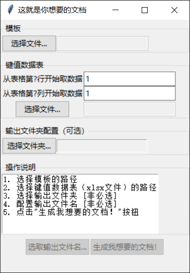
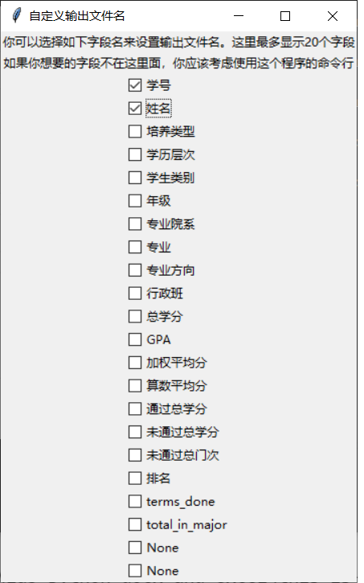

# 这就是你想要的文档 This is The Very Document yoU Want (TTVDUW)

## 这是干什么用的
这是一个**填表工具**，它可以根据**模板**和**给定表格**批量生成你想要的文件。

背景：

办公室工作总是免不了开各种奇奇怪怪证明，写各种各样会议邀请。这都21世纪20年代了，格式化的东西，就不能根据给定模板和待填数据自动生成吗？——毫无疑问是可以的，事实上不少信息系统必定会有这样的功能。

——问题是我想要批量生成的东西，系统里生成不了啊！！！例如什么成绩排名证明，还有什么在读证明，以及学生毕业设计的封面贴纸……

网上好像没有现成的个人用户app可以达成“根据模板填空”这样的目的。好在已经有能达成类似目的的[python-docx-template](https://docxtpl.readthedocs.io/en/latest)了。

~~你可以认为这个项目给python-docx-template写了（图形）用户界面~~

## 基本用法
```shell
# 配置环境
git clone https://github.com/y0umu/TTVDUW.git
cd TTVDUW
pip install -r requirements.txt
# 运行
python app_main.py
```
我的Python版本是3.8。不过Python 3.9、3.10应该也能使用。

这个app的入口是`app_main.py`，提供图形用户界面和命令行界面。如果不带任何命令行参数执行`app_main.py`，就会启动图形界面。

Windows用户也可以直接[下载](https://github.com/y0umu/TTVDUW/releases/)使用Pyinstaller打包的二进制程序，而不必配置环境。在这种情况下，解压后，运行TTVDUW.exe即可看到用户界面。

无论使用图形界面还是命令行，都需要准备**模板**和**键值数据表**。

用户配置模板（docx格式）：在模板中设置占位符1、占位符2…… 占位符的语法是所谓的[Jinja语法](https://jinja.palletsprojects.com/en/3.0.x/templates/)，占位符两侧要用`{{  }}`包裹起来。这个文件既可以用MS Word书像撰写普通文档那样书写，也可以用python-docx这样的工具生成。**但是必须保证格式是docx格式，不能是doc格式**

如果你看不明白“Jinja语法”到底说了什么事情，请打开`examples/成绩排名证明（推免）模板_tpl.docx`。这是一个样例模板文件。这个文件中，你会看到`{{ stu_name }}`、`{{ stu_college }}`这样的文本。这些在Word里面都是**普通**文本。这些文本经过程序处理后将会被**替换**，所以我把它们称为“占位符”。

- 注：“`{{`”之后需要空一格，“`}}`”之前也需要空一格。

占位符被替换成什么，则是由用户提供的**键值数据表**决定的。这个表提供了占位符名称（称为**键**，**key**，有时也称**字段**）与替换内容（称为**值**，**value**）之间的关系。示例文件`examples/2022级智能建造学生成绩排名_datafeed.xlsx`是一个键值数据表，其格式可供参考。

- 注：键值数据表中字段名应该是唯一的。程序在处理含有重名字段键值数据表时未必会报错，但输出文件的结果会变得不可靠。

### 图形用户界面
初上手本项目的用户可能更倾向于使用更为直观的图形用户界面。



**模板**（`-t, --template`）区域用来选择输入模板文件的位置。

**键值数据表**区域用来选择（`-f, --data-feeder-file`）键值数据表文件的位置。这个区域还有两个可配置参数“从表格第?行（列）开始取数数据”（`--tab-start-from-row`、 `--tab-start-from-col`），这两个参数是为了表格区域不是从左上角顶格的开始的xlsx文件准备的。例如你的表格有个标题把第1行占用了，那么你应该从第2行开始取数据。

**输出文件夹配置**区域用来选择输出目录的位置。如果不选，就会根据模板文件的文件名自动生成一个输出目录。

**操作说明**区域是给从来不看说明书的人准备的。



关于**选取输出文件名**按钮（`ttvduw_gui.TtvduwGui.btn_custom_outname`）：默认情况下，输出文件名是一串辨识度不太高的[Unix时间](https://time.is/zh/Unix_time_now)。这个按钮允许你将键值数据表中的部分字段的值作为文件名。

- 注1：如果你选了半天最后还是决定什么都不选，那么程序仍然会把Unix时间作为输出文件名。
- 注2：目前程序图形界面限制了最多显示20个字段（`ttvduw_gui.TtvduwGui.custom_outname_window`）。如果20个字段已经满足不了你的要求了，请用命令行（参数`--custom-out-names-with-keys`）。
- 注3（Bug？）：对于那些数据区域挨着一行被合并单元格的excel表格，本app使用的openpyxl在读取表格行的时候，会读出一行有16384个数据。虽然大部分情况感觉不到这一点，但是在这个选择输出文件名的模块会有体现：不对应实际表格区域的单元格被当作字段名收了进来，字段名显示为“None”。

关于**生成我想要的文档**按钮：这个不得了的按钮就像是奇迹的见证者。

### 命令行
命令行界面适合经常使用固定参数操作，或者需要编写脚本的用户。对此感到陌生的人应该直接去看[图形用户界面](#图形用户界面)这一节。

如下为命令行帮助。
```
usage: app_main.py [-h] -t TEMPLATE -f DATA_FEEDER_FILE [-o OUT_PATH]
                   [--tab-start-from-row TAB_START_FROM_ROW]
                   [--tab-start-from-col TAB_START_FROM_COL]
                   [--custom-out-names-with-keys CUSTOM_OUT_NAMES_WITH_KEYS [CUSTOM_OUT_NAMES_WITH_KEYS ...]]

optional arguments:
  -h, --help            show this help message and exit
  -t TEMPLATE, --template TEMPLATE
                        模板文件。docx格式
  -f DATA_FEEDER_FILE, --data-feeder-file DATA_FEEDER_FILE
                        键值数据表文件。目前只支持xlsx
  -o OUT_PATH, --out-path OUT_PATH
                        输出目录。如果不提供则根据 -t 指定的模板文件名生成
  --tab-start-from-row TAB_START_FROM_ROW
                        键值数据表文件从第几行开始有数据(default: 1)
  --tab-start-from-col TAB_START_FROM_COL
                        键值数据表文件从第几列开始有数据(default: 1)
  --custom-out-names-with-keys CUSTOM_OUT_NAMES_WITH_KEYS [CUSTOM_OUT_NAMES_WITH_KEYS ...]
                        使用哪些键的值作为输出文件名

```

例如：
```shell
python app_main.py -t "examples/成绩排名证明/成绩排名证明（推免）模板_tpl.docx" -f "examples/成绩排名证明/2022级智能建造学生成绩排名_datafeed.xlsx" --tab-start-from-row 2 --custom-out-names-with-keys stu_id stu_name
```

## 其他文件的说明
`ttvduw.py`: 底层实现
`ttvduw_gui.py`: 图形用户界面代码
`test_ttvduw.py`: 测试代码

## 构建Windows的二进制包
```powershell
# 构建
pip install -r requirements_with_pyinstaller.txt
pyinstaller -n TTVDUW app_main.py
# 运行构建的二进制包
.\dist\TTVDUW\TTVDUW.exe
```

## 功能完善路线图
目前app只有命令行界面，这对广大不熟悉命令行的职员们来说简直就是灾难。考虑实现
- [x] 一个简单的图形用户界面（使用Python自带的tkinter包）

让职员们去配置Python环境也是对大家的折磨。考虑使用[PyInstaller](https://www.pyinstaller.org/)
- [x] 打包

目前键值数据表只实现了xlsx的支持，后续还希望实现csv、xls支持。（看起来没多少事实际上界面各种逻辑估计涉及不少重写）
- [ ] csv （通过Python自带的csv包）
- [ ] xls （通过[xlrd](https://xlrd.readthedocs.io/en/latest/)包）

## Credits & References
开发工作还受到下面的资料的启发
- [Generating Custom Word Documents From Templates Using Python](https://blog.formpl.us/how-to-generate-word-documents-from-templates-using-python-cb039ea2c890)
- [知乎：python办公自动化（一）DocxTemplate批量生成word](https://zhuanlan.zhihu.com/p/320314207)

## 免责声明 Disclaimers
THE SOFTWARE IS PROVIDED “AS IS”, WITHOUT WARRANTY OF ANY KIND, EXPRESS OR IMPLIED, INCLUDING BUT NOT LIMITED TO THE WARRANTIES OF MERCHANTABILITY, FITNESS FOR A PARTICULAR PURPOSE AND NONINFRINGEMENT. IN NO EVENT SHALL THE AUTHORS OR COPYRIGHT HOLDERS BE LIABLE FOR ANY CLAIM, DAMAGES OR OTHER LIABILITY, WHETHER IN AN ACTION OF CONTRACT, TORT OR OTHERWISE, ARISING FROM, OUT OF OR IN CONNECTION WITH THE SOFTWARE OR THE USE OR OTHER DEALINGS IN THE SOFTWARE.

本软件由版权持有人及其他责任者“按原样”提供，包括但不限于商品的内在保证和特殊目的适用，将不作任何承诺，不做任何明示或暗示的保证。 在任何情况下，不管原因和责任依据，也不追究是合同责任、后果责任或侵权行为(包括疏忽或其它)，即使被告知发生损坏的可能性，在使用本软件的任何环节造成的任何直接、间接、偶然、特殊、典型或重大的损坏(
包括但不限于使用替代商品的后果：使用、数据或利益的损失或业务干扰)，版权持有人、其他责任者或作者或所有者概不承担任何责任。（中文翻译供参考，摘自：作者：qqwendy617 链接：https://www.zhihu.com/question/24296378/answer/138273825）
